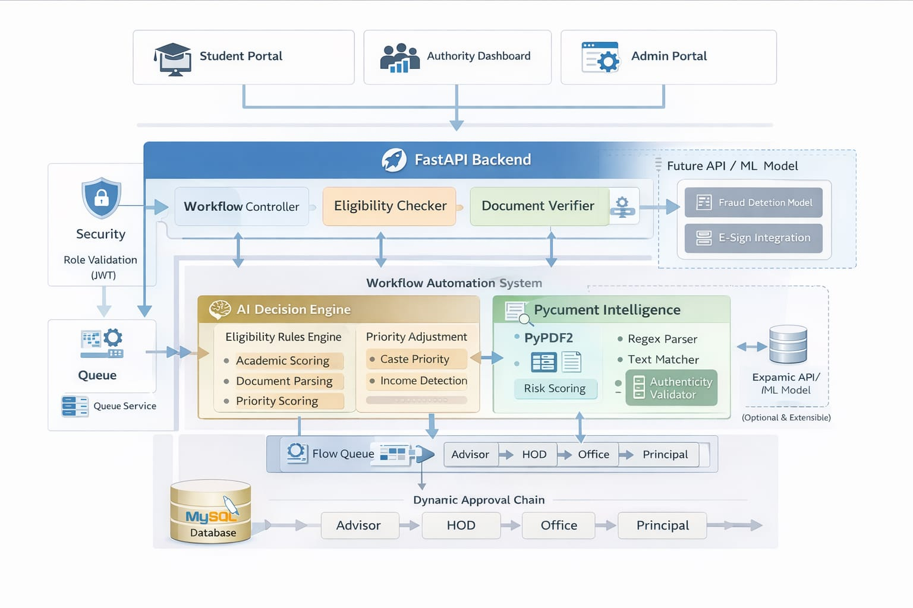
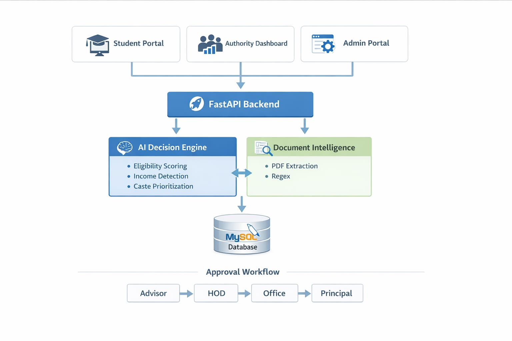

<p align="center">
  
</p>

# Cogniz 🎯

## Basic Details

### Team Name: SheCodes

### Team Members

- Member 1: Ganga Sunil - Mar Athanasius College of Engineering
- Member 2: Sadhika Pradeep - Mar Athanasius College of Engineering

### Project Description

IntelliFlow AI is an intelligent workflow automation system that digitizes approval processes and enhances them using AI-powered document verification and decision intelligence.

The system evaluates eligibility conditions, verifies uploaded documents using intelligent parsing, predicts approval probability, and tracks multi-level approvals dynamically.

This is not limited to scholarships — it is scalable to:

Government welfare schemes

College approvals

Corporate reimbursements

Healthcare insurance claims

Grant & subsidy applications

### The Problem statement

Applicants Face:

- No idea if they qualify

- No rejection reason clarity

- No visibility on approval stage

- No approval probability insight

Institutions Face:

- Manual document verification

- Fake certificate submissions

- Slow approval workflows

- No predictive prioritization

- Heavy manual workload

### The Solution

IntelliFlow AI transforms static approval workflows into AI-assisted decision intelligence platforms.

It provides:

- Role-based login (Student, Advisor, HOD, Office, Principal, Admin)

- AI-based PDF extraction

- Income threshold detection (≤ ₹6,00,000 → high weight)

- Caste priority detection (SC/ST > OBC > General)

- AI Approval Probability Score

- Multi-stage dynamic workflow

- Rejection with mandatory reason

- Real-time student tracking dashboard

- Auto-refresh status updates

- Rule configuration via database

---

## Technical Details

### Technologies/Components Used

**For Software:**

- Languages used:Python,JavaScript,sql,html/css
- Frameworks used: fastAPI(Backend),Uvicorn(ASGI Server)
- Libraries used:PyPDF2,mysql-connector-python,python-multipart,re
- Tools used:vscode,mysql,git,postman

---

## Features

List the key features of your project:
Core Features

- Role-based login (Student, Advisor, HOD, Office, Principal, Admin)

- AI-based PDF extraction

- Income threshold detection (≤6 Lakh high approval weight)

- Caste priority detection (SC/ST > OBC > General)

- AI Approval Probability Score

- Multi-stage dynamic workflow

- Rejection with mandatory reason

- Real-time student tracking dashboard

- Auto-refresh on approval/rejection

- Rule configuration via database

- Domain simulation (College, Government, Healthcare)

---

## Implementation

### For Software:

#### Installation

````bash
pip install -r requirements.txt```

#### Run
```bash
uvicorn main:app --reload
````

#### Mysql

USE workflow_db;
SHOW TABLES;

## Project Documentation

### For Software:

#### Screenshots (Add at least 3)

_Login Page_


_Role Based Acess_


_Student Portal_


_Advisor Portal_


#### Diagrams

**System Architecture:**


**Application Workflow:**


## Additional Documentation

### For Web Projects with Backend:

#### API Documentation

**Base URL:** `http://127.0.0.1:8000`

##### Endpoints

**GET /api/endpoint**

- **Description:** POST /login

Description:
Authenticates users based on role (Student, Advisor, HOD, Principal, Admin).

- **Response:**

```json
{
  "status": "success",
  "data": {}
}
```

**POST /api/endpoint**

- **Description:** [What it does]
- **Request Body:**

```json
{
  "email": "student@example.com",
  "password": "password123",
  "role": "Student"
}
```

- **Response:**

```json
{
  "status": "success",
  "message": "Login successful",
  "role": "Student"
}
```
##Demo vedio
https://drive.google.com/drive/u/1/home


## AI Tools Used (Optional - For Transparency Bonus)

If you used AI tools during development, document them here for transparency:

**Tool Used:** ChatGPT

**Purpose:**

- Generated boilerplate React components
- Debugging assistance for async functions
- Code review and optimization suggestions

**Key Prompts Used:**
Key Prompt Used
Create a clean, professional system architecture diagram for an AI-powered workflow automation system.
The diagram should be layered and visually organized.
Top Layer:
Student Portal
Authority Dashboard
Admin Portal
Middle Layer (Backend):
FastAPI Backend
Workflow Controller
Eligibility Checker
Document Verifier
Security Layer (Role Validation / JWT)
Intelligence Layer:
AI Decision Engine
Eligibility Rules Engine
Academic Scoring
Income Detection
Caste Prioritization
Priority Adjustment
Document Intelligence Module
PyPDF2
Regex Parser
Text Matcher
Authenticity Validator
Database Layer:
MySQL Database
Approval Chain:
Advisor → HOD → Office → Principal
Include arrows showing data flow between layers.
Use soft blue and green tones.
Make it modern, clean, minimal, infographic style.
White background.
Professional startup presentation style.

**Percentage of AI-generated code:** Approximately 20–30%

AI was primarily used for:

Debugging assistance

Code optimization suggestions

Regex pattern refinement

Structuring API endpoints

**Human Contributions:**
Complete system architecture design

AI Priority Intelligence Engine concept

Policy-aware scoring model design

Business logic decisions (income threshold, caste priority weighting)

Database schema design (users, requests, workflow stages)

Multi-stage dynamic workflow implementation

PDF document validation logic refinement

Approval probability formula creation

Role-based access system

Dashboard implementation

Integration and end-to-end testing

Domain scalability design (college, government, healthcare simulation)

## Team Contributions

Ganga Sunil

Backend development (FastAPI)

AI scoring logic design

Database schema & modeling

Multi-level workflow automation

Document validation engine

Regex-based income extraction

Approval probability system

API design & implementation

System architecture planning

👨‍💻 Sadhika Pradeep

Frontend UI development (HTML, CSS, JavaScript)

Dashboard design

API integration

UI responsiveness

Workflow stage visualization

Integration testing

API testing using Postman

## License

This project is licensed under the MIT License.

MIT License is:

Permissive

Widely used in open-source projects

Allows reuse with attribution

Suitable for hackathon and academic projects
